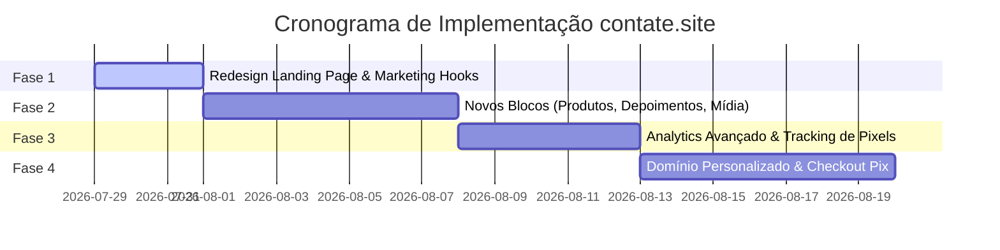

# Plano de Ação: Igualando e Superando os Recursos de BonPages & Bio Sites no contate.site

> **Objetivo:** Transformar o **contate.site** na plataforma líder no Brasil para criadores de conteúdo, infoprodutores, freelancers e pequenos negócios, igualando e superando as funcionalidades de concorrentes globais como **BonPages.com** e **Bio Sites (Squarespace)**.

---

## 📊 1. Análise Comparativa de Recursos

| Recurso / Funcionalidade | **BonPages** | **Bio Sites** | **contate.site** *(Atual)* | **contate.site** *(Meta)* |
| :--- | :---: | :---: | :---: | :---: |
| **Navegação Multi-páginas** | ✅ Sim | ❌ Apenas 1 página | 🟡 Parcial | ✅ Total (Abas e subpáginas) |
| **Biblioteca de Blocos** | 27 blocos | 12 blocos | ~10 blocos | 30+ blocos modulares |
| **Domínio Personalizado (`seunome.com.br`)** | ✅ Sim (Pro) | ❌ Limitado | 🟡 Em planejamento | ✅ Nativo com SSL automático |
| **Vitrine de Produtos / E-commerce** | ✅ Sim | ✅ Sim | 🟡 Básico | ✅ Catalógo com checkout Pix/Stripe |
| **Captura de Leads / Formulários** | ✅ Sim | ✅ Sim | 🟡 Básico | ✅ Leads com notificação no WhatsApp/E-mail |
| **Analytics & Geolocalização em Tempo Real** | ✅ Sim | ✅ Sim | 🟡 Básico | ✅ Mapa interativo, origem UTM e Pixel |
| **Embeds de Mídia (YouTube, Spotify, TikTok)** | ✅ Sim | ✅ Sim | 🟡 Parcial | ✅ Reprodução direta no perfil |
| **Agendamento 1:1 (Consultoria / Calendly)** | ❌ Não | ✅ Sim | ❌ Não | ✅ Bloco nativo de agendamento |
| **Pagamento Instantâneo via Pix** | ❌ Não (Foco US) | ❌ Não (Foco US) | 🟡 Parcial | ⚡ **Diferencial Nacional** |

---

## 🛡️ 2. Pilares Técnicos para Alcance de Paridade

### Pilar A: Expansão do Construtor de Blocos (Block Builder)
- [ ] **Bloco de Vitrine E-commerce:** Permite cadastrar imagem, título, preço de/por, status de estoque ("Disponível" / "Esgotado") e botão "Comprar via Pix" ou "Pedir no WhatsApp".
- [ ] **Bloco de Mídia Rich Embed:** Suporte a reprodução direta sem sair da bio para vídeos do YouTube, Reels/TikTok e player do Spotify/Apple Music.
- [ ] **Bloco de Agendamentos 1:1:** Integração com Calendly ou formulário de marcação de horários diretamente na bio.
- [ ] **Bloco de Depoimentos & Prova Social:** Carrossel/Cards de avaliações de clientes satisfeitos com foto e nota 5 estrelas.
- [ ] **Bloco de FAQ Sanfonado (Accordion):** Para tirar dúvidas frequentes de compradores de cursos ou serviços.

### Pilar B: Domínios Personalizados e SSL Automático
- [ ] Implementar integração com provedor de DNS (ex: Cloudflare for Platforms / Supabase Edge Custom Domains) permitindo aos usuários do plano PRO apontarem seu próprio domínio (`www.minhamarca.com.br`).
- [ ] Provisionamento automático de certificado SSL (HTTPS).

### Pilar C: Analytics Profissional & Rastreamento de Conversão
- [ ] **Métricas em Tempo Real:** Dashboard de visitantes ao vivo, gráfico de cliques por horário e mapa de origem dos acessos (por estado/cidade no Brasil).
- [ ] **Rastreamento de Origem (UTM):** Rastrear se o clique veio do Instagram Stories, TikTok, Link na Bio, YouTube ou tráfego pago.
- [ ] **Pixel de Conversão:** Suporte a Meta Pixel (Facebook/Instagram), Google Analytics 4 e TikTok Pixel para permitir remarketing do usuário.

### Pilar D: Integrações Financeiras & Automações Locais (Brasil-First)
- [ ] **Checkout Pix Instantâneo:** Geração de QR Code e Pix Copia e Cola diretamente no checkout da bio com confirmação automática (webhooks via Mercado Pago/Asaas/Stripe).
- [ ] **Notificações via WhatsApp:** Envio de alertas automáticos quando um novo lead preencher o formulário ou um produto for comprado.

---

## 🗓️ 3. Cronograma de Execução

---

## 📈 4. Adaptação de Marketing & Copywriter (pt-BR)

### Ganchos de Alta Conversão Criados para o Brasil:
1. *"Chega de perder vendas porque o Instagram só deixa colocar 1 link."*
2. *"Sua vitrine profissional completa em menos de 5 minutos, sem precisar contratar um programador."*
3. *"Receba pagamentos via Pix direto do seu link da bio, sem intermediários com taxas abusivas."*
4. *"Conheça quem visita seu perfil, entenda o comportamento dos seus seguidores e venda mais todo dia."*

---

## 🚀 5. Métricas e Prova Social Futura (Para ativar quando a base crescer)

> **Nota de Transparência:** Os contadores numéricos e badges estatísticos simulados foram removidos da Landing Page para garantir total autenticidade durante a fase inicial de lançamento.

- [ ] **Badges Flutuantes de Atividade na Demonstração:** Exibir badges dinâmicos de engajamento no celular interativo (ex: `⚡ +1.840 cliques essa semana`, `📅 42 Agendamentos hoje`, `💰 R$ 14.890 em vendas Pix`, `📦 89 Pedidos enviados`).
- [ ] **Contador Global de Criadores Ativos:** Exibir o total real de criadores cadastrados no topo do Hero (ex: `Usado por +10.000 criadores e negócios no Brasil`) via consulta direta no Supabase.
- [ ] **Notificações Toast em Tempo Real (Social Proof):** Notificações no canto da tela informando sobre novas contas e links criados recentemente.
