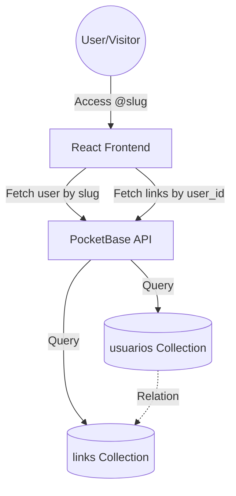

## 🏛️ Architect's Map (Mapeamento do Arquiteto)

### Current Data Flow

### Proposed Architectural Improvements
1. **Analytics Collection**: Create a `cliques` collection to track link performance (ID, link_id, timestamp, device_type).
2. **SEO Metadata**: Add `meta_titulo` and `meta_descricao` to the `usuarios` collection for better sharing previews.
3. **Caching Strategy**: Implement a simple cache layer for public profiles to reduce PocketBase hitting the disk constantly.

## 🎨 Designer's Proposal (Mudança do Designer)

### Current State
- Simple vertical list of links.
- Single background color.
- Basic avatar.

### The "Premium/Modern" Transformation
1. **Bento Grid Layout**: Instead of just a list, allow "Large Cards" and "Small Cards" (2x2 grid) for social media vs. websites.
2. **Glassmorphism**: Use semi-transparent cards with `backdrop-blur` over dynamic gradients.
3. **Animations**: Smooth entrance animations for each card using `framer-motion`.
4. **Theme Presets**: Move beyond simple colors to curated palettes (e.g., "Midnight Neon", "Sunset Minimalist").

### Mockup Suggestion
- **Background**: Soft mesh gradient.
- **Cards**: `bg-white/10` with white borders and shadow.
- **Typography**: Inter or Outfit (clean and bold).

## Competitive Analysis (Keywords)
- Bento.me (Grid/Bento style)
- Linktree (Classic list style)
- Taplink
- Carrd.co
